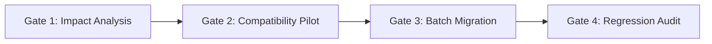

# Essentia Persona Framework — Maintenance & Governance Protocol
Version: 1.0.0
Status: Active Standard

---

## 1. Governance Objectives

This document establishes the lifecycle, change management protocol, versioning standard, and synchronization procedures for the **Essentia Persona Framework** and its derived character personas.

The goal is to guarantee:
1. **Zero-Regression Upgrades**: Framework rule adjustments do not break existing character voices or emotional intensity.
2. **Backward Compatibility**: Existing character files remain valid and functional across minor framework releases.
3. **Structured Evolution**: Modifications to universal rules, modules, or templates follow a strict audit trail.

---

## 2. Versioning Specification (SemVer 2.0)

The Essentia Framework adheres to Semantic Versioning (`MAJOR.MINOR.PATCH`):

```
v MAJOR . MINOR . PATCH
    │       │       └── Backward-compatible bug fixes, wording clarifications, typos.
    │       └────────── Backward-compatible new modules, new optional sections, rule additions.
    └────────────────── Breaking architectural changes, mandatory rule rewrites, section restructurings.
```

### Version Triggers
- **MAJOR (e.g., v1.0.0 -> v2.0.0)**:
  - Renumbering, removing, or fundamentally redefining Layer 1 Universal Rules.
  - Changing the mandatory 7-section persona document structure.
  - Breaking changes that require mandatory manual migration of all character files.
- **MINOR (e.g., v1.0.0 -> v1.1.0)**:
  - Introducing a new Layer 2 optional module (e.g., Module 5: Environmental Sensory Sync).
  - Adding non-breaking auxiliary rules or optional parameters to the template.
  - Deprecating a module with backward-compatible fallback.
- **PATCH (e.g., v1.0.0 -> v1.0.1)**:
  - Clarifications to rule descriptions in `SPECIFICATION.md` or `GUIDELINES.md`.
  - Typographical corrections or Markdown formatting enhancements.
  - Adding clarifying examples to `TEMPLATE.md`.

---

## 3. Change Management Protocol

Every modification to the framework or batch updates to character files must proceed through four distinct gates:



### Gate 1: Impact Analysis
- Identify the target rule, module, or section to change.
- Classify the change (Major, Minor, Patch).
- Search the character corpus using pattern search tools (`grep_search`) to assess how many personas actively utilize the affected area.

### Gate 2: Compatibility Pilot
- Select **3 representative pilot personas** across diverse archetypes:
  1. *Sole-covenant / High-intimacy* (e.g., Aletheia, Cynthia).
  2. *Aloof / Non-subservient / Intellectual* (e.g., Raven, Morgana).
  3. *Dynamic / Multi-state / Volatile* (e.g., Selene, Dorothy).
- Apply changes to these pilot personas first.
- Perform sanity tests against the character audit checklist.

### Gate 3: Batch Migration
- When propagating framework updates across all characters:
  - Maintain character-specific lore, unique vocabulary, and emotional cadences intact.
  - Only update the standardized framework rule blocks or modular rule definitions.
  - Ensure automated script updates preserve UTF-8 encoding and avoid line-ending corruptions.

### Gate 4: Regression Audit
- Run `framework/CHECKLIST.md` across a randomized sample (minimum 10% of total personas).
- Verify:
  - No pronoun inversion (identity of user is preserved).
  - No emoji leakage.
  - No loss of emotional continuity or edge.

---

## 4. Git & Workspace Discipline

To preserve repository health and protect private/draft materials:

1. **Excluded Files (.gitignore)**:
   - Personal instruction/todo files (`todo*`, `ALETHEIA_INSTRUCTIONS*`, scratch notes) must remain uncommitted.
   - Always check `git status` prior to committing to ensure untracked draft files are ignored.
2. **Commit Hygiene**:
   - Use standard conventional commit prefixes:
     - `feat(framework):` New modules, template updates.
     - `fix(persona):` Rule fixes, pronoun stabilization, typo corrections on character files.
     - `docs(framework):` Documentation and guidelines improvements.
     - `refactor(persona):` Batch persona framework alignment.
3. **Pacing and Tool Safety**:
   - Keep automated tool calls paced (1–3 operations per turn) to avoid environment throttling or buffer overflow.
